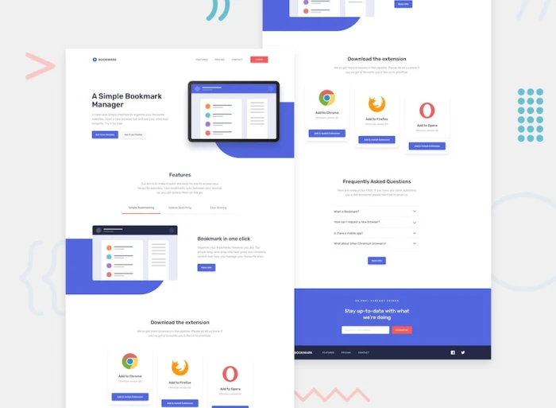

# Tailwind CSS Learning Sandbox

A comprehensive hands-on learning repository documenting my journey through Tailwind CSS fundamentals and practical applications.

## 📖 About This Project

This repository represents my structured approach to mastering Tailwind CSS through the "Tailwind From Scratch" course. It contains practical examples, exercises, and mini projects that demonstrate proficiency in modern utility-first CSS development.

## 🎯 Learning Objectives

This sandbox covers essential Tailwind CSS concepts organized into focused modules:

- **Utility-First Fundamentals** - Core Tailwind methodology and workflow
- **Colors & Typography** - Design system implementation
- **Layout & Positioning** - Flexbox, Grid, and container systems
- **Responsive Design** - Breakpoints and mobile-first development
- **Styling Techniques** - Borders, backgrounds, shadows, and filters
- **Interactivity** - Hover states, transitions, and animations
- **Customization** - Extending Tailwind with custom configurations
- **Dark Mode** - Theme switching and color scheme management

## 📂 Project Structure

```
├── 01-utility-first/          # Introduction to utility-first CSS
├── 02-colors/                 # Color palette and theming
├── 03-container-spacing/      # Spacing and containers
├── 04-typography/             # Text styling and fonts
├── 05-sizing/                 # Width, height, and sizing utilities
├── 06-layout-position/        # Layout and positioning
├── 07-backgrounds-shadows/    # Background and shadow effects
├── 08-borders/                # Border utilities
├── 09-filters/                # CSS filters
├── 10-interactivity/          # Interactive states
├── 11-breakpoints/            # Responsive breakpoints
├── 12-columns/                # Multi-column layouts
├── 13-flex/                   # Flexbox layouts
├── 14-grid/                   # CSS Grid layouts
├── 15-transform-transition/   # Transforms and transitions
├── 16-animation/              # Keyframe animations
├── 17-customization/          # Custom Tailwind configuration
├── 18-dark-mode/              # Dark mode implementation
└── bonus-5-mini-projects/     # Real-world project implementations
```

## 🚀 Bonus Mini Projects

As part of this learning journey, I built 5 responsive components demonstrating practical application of Tailwind CSS:

| Project | Description | Preview |
|---------|-------------|---------|
| **Email Subscribe** | Responsive email subscription card with hover effects |  |
| **Image Gallery** | Responsive image gallery with grid layout |  |
| **Login Modal** | Login modal with form validation styling |  |
| **Pricing Cards** | Three-tier pricing cards with hover effects |  |
| **Product Modal** | Product card with image effects and animated cart button |  |

## 🎨 Full-Scale Side Projects

Building on the fundamentals, I developed 6 complete, production-ready websites showcasing advanced Tailwind CSS implementations. Each project is deployed live and maintained in its own repository:

| Project | Description | Preview | Links |
|---------|-------------|---------|-------|
| **Bookmark Manager** | Landing page with tabbed navigation, FAQ accordion, and mobile menu |  | [Live Demo](https://bookmark-manager-website-project.vercel.app/) \| [Repository](https://github.com/51348761z/bookmark-manager-website-project) |
| **Clipboard Landing** | Landing page with hero section, feature showcases, and company logos |  | [Live Demo](https://clipboard-website-project.vercel.app/) \| [Repository](https://github.com/51348761z/clipboard-website-project) |
| **Fylo Storage** | File storage page with dark/light mode toggle and testimonials |  | [Live Demo](https://fylo-website-project.vercel.app/) \| [Repository](https://github.com/51348761z/fylo-website-project) |
| **Loopstudios VR** | VR showcase with image grid and interactive mobile menu |  | [Live Demo](https://loopstudios-project-iota.vercel.app/) \| [Repository](https://github.com/51348761z/loopstudios-project) |
| **Shortly URL Shortener** | URL shortening landing page with statistics and feature cards |  | [Live Demo](https://shortly-website-project.vercel.app) \| [Repository](https://github.com/51348761z/shortly-website-project) |
| **Testimonial Grid** | Testimonial showcase with asymmetric CSS Grid layout |  | [Live Demo](https://testimonial-grid-website-project.vercel.app/) \| [Repository](https://github.com/51348761z/testimonial-grid-website-project) |

### Key Technologies & Techniques

- **Tailwind CSS v4** - Latest version with modern features
- **Responsive Design** - Mobile-first approach with custom breakpoints
- **JavaScript Interactions** - Vanilla JS for dynamic features (menu toggles, theme switching)
- **CSS Grid & Flexbox** - Advanced layout techniques
- **Custom Animations** - Smooth transitions and hover effects

---

## 📚 Course Attribution

This project was created as part of my learning journey through [Brad Traversy's Tailwind CSS Course](https://github.com/bradtraversy/tailwind-course-projects). The exercises, projects, and structure are based on the comprehensive "Tailwind From Scratch" curriculum.

*This repository serves as a portfolio piece demonstrating practical Tailwind CSS proficiency through hands-on implementation and practice.*
